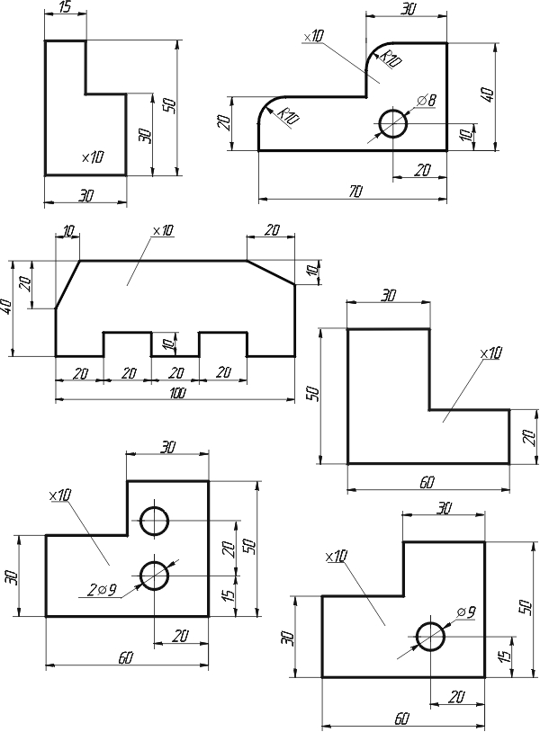
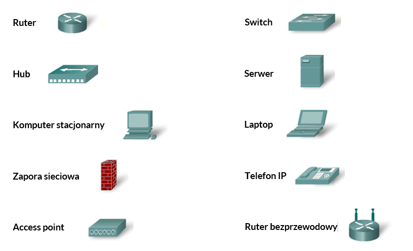
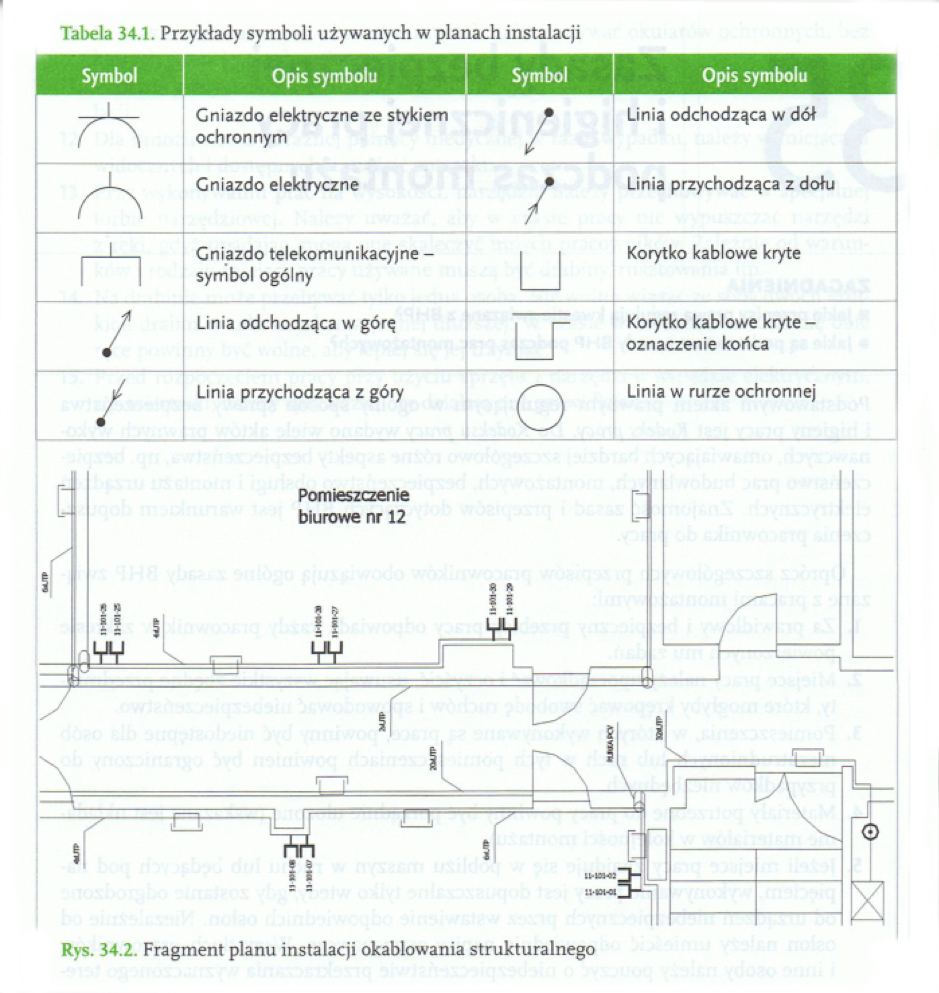

# Podstawowe pojęcia dotyczące lokalnej sieci komputerowej

Sieć Komputerowa to system do przesyłania danych składający się z <u>co najmniej dwóch</u> urządzeń komputerowych. Sieci pozwalają na wymianę danych, korzystanie z urządzeń peryferyjnych, wspólnych baz danych, oprogramowania i plików.

Pierwszą siecią komputerową był <u>ARPANET</u> którego celem było połączenie uniwersytetów w USA. 

<u>ETHERNET</u> to nowszy protokół, mniej awaryjny, spopularyzował się równie szybko jak ARPANET i wyparł pozostałe protokoły. Firmy komercyjne i agencje rządowe stać było na takie rozwiązania natomiast zwykłego użytkownika nie, sytuacja zmieniła się w latach 80. gdy pojawiła się łączność modemowa <u>BBS (Bulletin Board System)</u>. Modem kodował informacje z komputera z cyfrowego na analogowy i analogowego na cyfrowy do komputera (połączenie <u>point-point</u>).

<u>INTERNET</u> połączenie różnych mniejszych sieci, nazwę ARPANET zamieniono na INTERNET.

## Typy sieci ze względu na obszar, przeznaczenie i przepustowość.

- WAN - Wide Area Netwoek (między miastami)

- MAN - Metropolitan Area Network (w miastach)

- CAN - Campus Area Network (między budynkami)

- LAN - Local Area Network (komputery w jednym budynku)

- PAN - Personal Area Network (łączenie z urządzeniami peryferyjnymi, bluetooth)

## Elementy Sprzętowe

### Urządzenia transmisji:

- Materialne - kable i światłowody

- Niematerialne - fale radiowe

### Urządzenia Dostępu:

- Karty Sieciowe

- Modemy

- Karty Bezprzewodowe

### Urządzenia Wzmacniania Sygnałów

- Wzmacniacze Sygnału

## Elementy Programowe

- Protokoły - określają sposoby komunikowania się urządzeń.

- Sterowniki Urządzeń - umożliwiają działanie urządzeń.

- Oprogramowanie Komunikacyjne - programy umożliwiające przesyłanie plików i danych

## Łącza komunikacyjne

Węzły Sieci - zbiega wiele sygnałów ze sobą i przekazuje go dalej. (rouetry, switche)

- Serwer - udostępnia zasoby

- Klient - korzysta z zasobów

Szafy sieciowe - do ergonomicznej organizacji miejsca, wymiary podaje się w u (1,75" = 44,5mm), szerkość 10" lub 19".

Adresy - aby dane były swobodnie przemieszczane każde urządzenie powinno mieć przypisany swój jednoznaczny adres IP (zmienia się w zależności od miejsca podłączenia) oraz niepowtarzalny indywidualny identyfikator MAC.

## Wymiarowanie

**Wymiary A4: 210x297**

Wymiarowanie jest to podawanie wymiarów przedmiotów na rysunkach technicznych za pomocą linii, liczb i znaków wymiarowych.

Umożliwia ono odczytanie rysunku i wykonanie przedmiotu zgodnie z wymaganiami konstruktora. Rysunek techniczny będący podstawą wykonania przedmiotu, narysowany bez wymiarów albo z błędami i brakami w zakresie wymiarowania nie ma żadnej wartości.

### Znaki wymiarowe

Linie Pomocnicze - 

Strzałki Wymiarowe grot około 20 stopni, wyjątkowo można zastąpić go linią bądź kropkami

Liczby Wymiarowe - nie stykają się z liniami wymiarowymi, wymiary podaje się w

milimetrach chyba że legenda mówi inaczej. Wszystkie liczby wymiarowe w danym projekcie muszą mieć jednakową wysokość i być zwrócone w jedną z dwóch użytych w danym projekcie tak by móc przeczytać wszystkie wymiary obracając kartkę raz o 90 stopni.

#### Rodzaje Linii Rysunkowych

- Linia ciągła bardzo gruba: tabelka numeru rysunku, połączenia klejone, lutowane
- Linia ciągła gruba: zarysy przedmiotów, kształty przekrojów
- Linia Ciągła cienka: linia wymiarowa, linie pomocnicze odnoszące, znaki chropowatości powierzchni, tabelka tolerancji, kreskowanie przekrojów, osie otowrów o średnicy mniejszej lub równej 12[mn]
- Lina kreskowa cienka: linie niewidoczne przedmiotu
- Lina dwupunktowa: osie symetrii otworów o średnicy większej niż [12mn]
- Linia falowana

#### Wymiary i sposób zapisu

Na rysunku podaje się wymiary rzeczywiste w minimetrach (chyba że tabelka podaje inaczej), nie podaje się obok wymiarów jednostki miary. Liczby wymiarowe pisane są pismem technicznym którego wysokość wynoski min. 3,5mm, nie dotykają linii wymiarowych i pisane są na ich środku.

Linie wymiarowe są cienkie i rysowane w odległości 10mm od linii wymiarowych, nie mniejszej niż 7mm od poprzednich.

### Zasady Wymiarowania

- Wymiarowanie rozpoczynamy od podawania wymiarów najmniejszych
- Linie nie powinny się krzyżować z innymi liniami
- Nie podaje się wymiarów zbędnych
- Nie zamyka się łańcucha wymiarowego, przy czym pomija się wymiar najmniej ważny
- Środek otworu podaje się dwoma wymiarami
- Powyżej 10mm liczba wymiarowa w środku, strzałki na zewnątrz
- Poniżej 10mm liczba wymiarowa na zewnątrz, strzałki do środka otworu
- grubość przedmiotu podaje się literą &#39;x&#39;, a średnicę &#39;Ø&#39;, a promień R
- Osie otworów powyżej 12mm zaznacza się linami punktowanymi cienkimi
- Osie poniżej 12mm zaznacza się liniami ciągłymi cienkimi
- Nie powtarza się wymiarów

## Symbole graficzne urządzeń sieciowych

#### Symbole graficzne przydatne podczas projektu sieci lokalnej

## Jednostki miar w sieciach komputerowych oraz parametry techniczne

### Jednostki pojemności pamięci

- b (bit) 0 albo 1 (włączony/wyłączony)

- Kb (Kilobit, Kbit) 1Kb = 1024b

- Mb (Megabit, Mbit) 1Mb = 1024Kb

- Gb (Gigabit, Gbit) 1Gb = 1024Mb

- Tb (Terabit, Tbit) 1Tb =  1024Gb

- B (Bajt) 1B = 8b (litera w kodzie ASCII)

- KB (kilobajt) 1KB = 1024B (E-Mail ok. 2KB)

- MB (Megabajt) 1MB = 1024KB

- GB (Gigabajt) 1GB = 1024MB

- TB (Terabajt) 1TB - 1024GB

### Wybrane jednostki szybkości

- bps (bits per second)

- Bps (Bytes per second)

- cps (characters per second)

- ppm (pages per minute) (stronnice druku na minute)

- rpm (rounds per mitue) (obroty dysku na minute)

### Wybrane jednostki gęstości i rozdzielczości

- bpi (bits per inch)

- dpi (dots per inch)

- cpi (characters per inch)

- tpi (tracks per inch)

### Jednostki czasu używane w komputerach

- ms milisekunda 1 ms = 0,001s

- us mikrosekunda 1 us = 0,000001s

- ns nanosekunda 1  ns = 0,00000001s

### Jednostki mocy obliczeniowej

- MIPS (Milion Instructions Per Second) - Liczba milionów operacji na sekundę

- MFLOPS (megaflops, Milion Floating Point Operations per Second) - Liczba milionów operacji zmiennoprzecinkowych na sekundę

- TFLOPS  (teraflops)
- PFLOPS (petaflops)

### Sieci lokalne w standardzie Ethernet

| Nazwa |Max. prędkość   |
| --- | --- |
| Ethernet | 10Mb/s |
| FastEthernet | 100Mb/s |
| GigabitEthernet | 1000Mb/s |
| 10GigabitEthernet | 10000Mb/s |
| 100GigabitEthenret | 100000Mb/s |

<u>Bilans mocy linii światłowodowej</u> - maksymalny zasięg światłowodu, w dB. Wartość wyrażona w dB wyraża wzrost (dodatnia) lub spadek (ujemna) mocy. Liczba decybeli pozwala stwierdzić ile energii pozostało w falii radiowej np. po pokonaniu określonej odległości

<u>SNR</u> - stosunek sygnału do szumu (dB), określa moc użytecznego sygnału